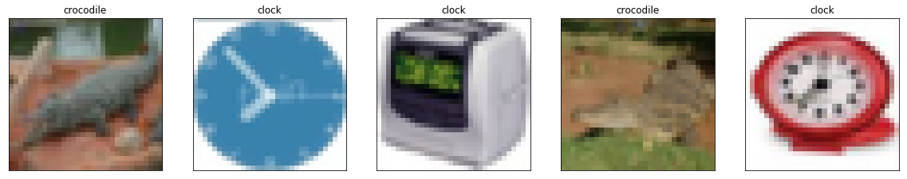
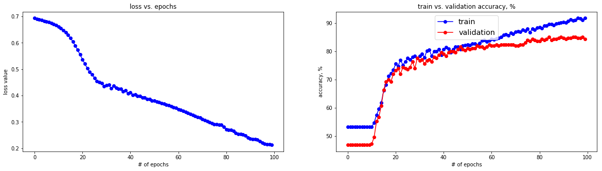
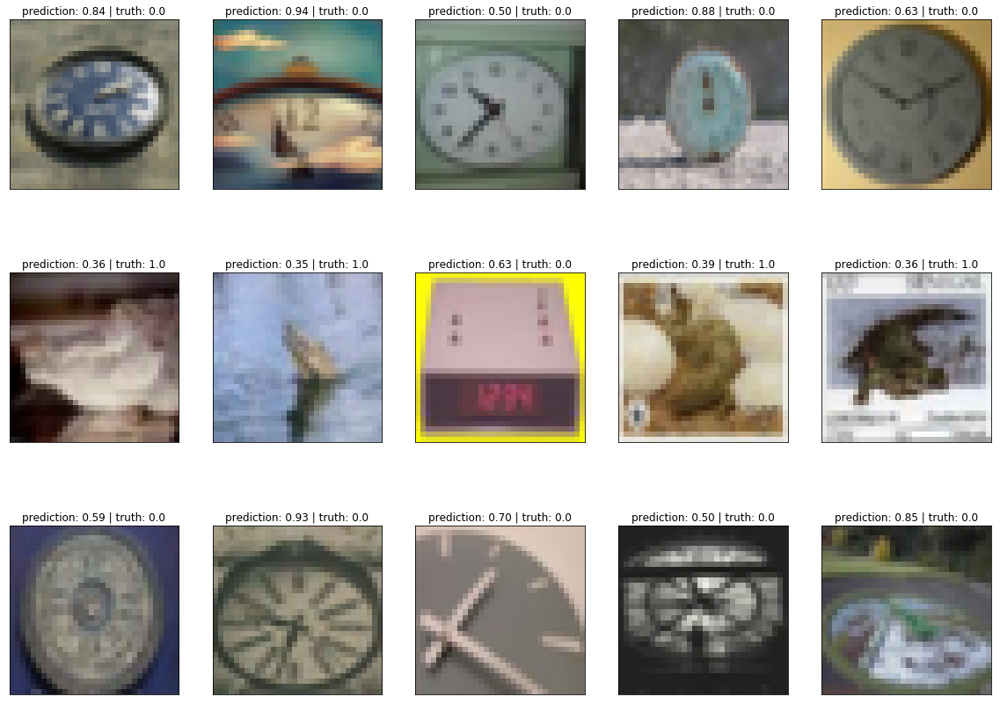
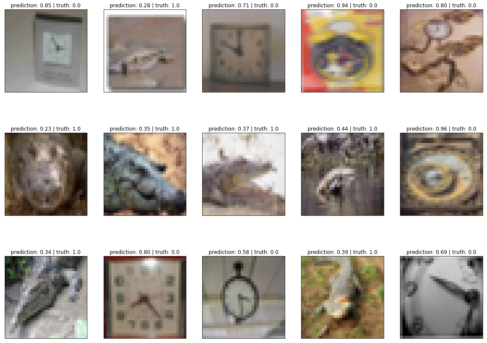
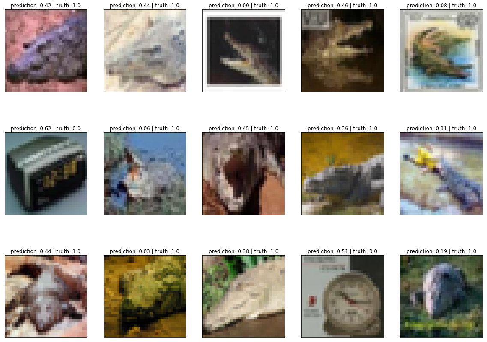
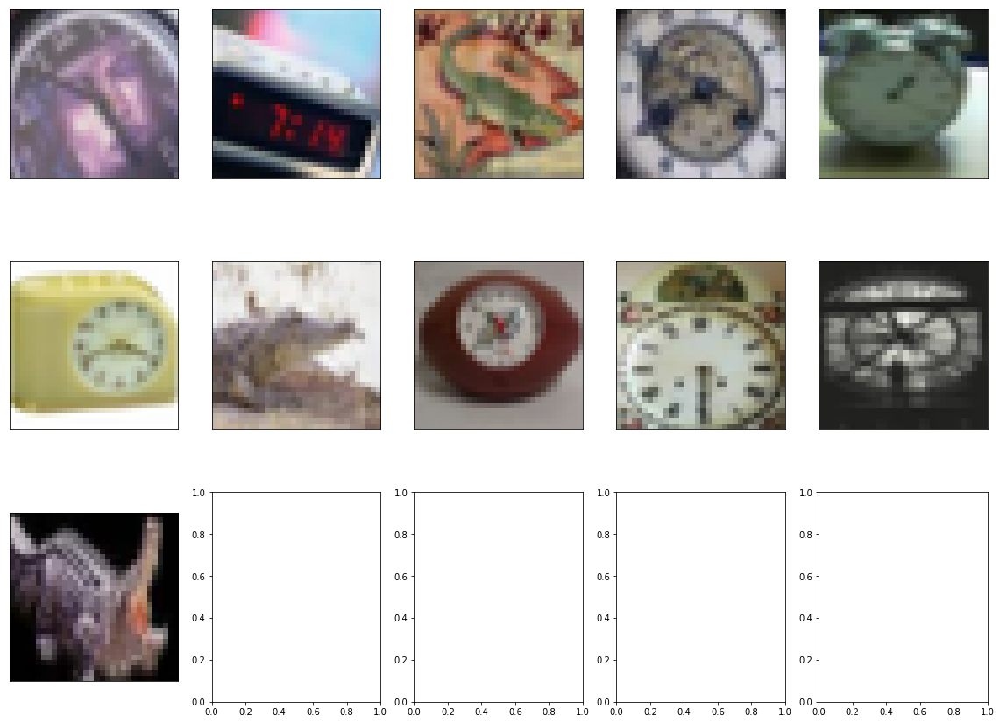

# Clocks and Crocodiles

## My name is Andrei Davydov and here is my project report for Skoltech summer internship in Samsung. 

## The project is devoted to the research based on the dataset with images of clocks and crocodiles. 

The project consists of three parts: 
  - binary **classification** of images (1), 
  - **extraction** of the images that are debateable on the issue, which label must be assigned to (2),
  - **generation** of new images that would hardly correspond to one of two classes (3).
  
Let us talk about each part and my achievements on them. 

*All implementation is written on the Python (3.6) using ordinary libraries: Numpy (1.14.0), Matplotlib (2.1.2), Scikit (0.19.1). Also the library specifically developed for comfortable neural network implementation was used - pyTorch (0.3.0.). All NN-based calculations were performed with CUDA (9.0) driver on the GPU Nvidia GeForce GTX 950m for faster evaluation.*

### 1. Classification

#### 1.0. Preprocessing

First of all, a proper preprocesssing must be achieved. Each image from folders must have its true label (let's say, '0' corresponds to 'clock', '1' - to 'crocodile') and all images must be stacked together in the whole array. Then this array must be splitted in the Train, Validation and Test sets for the following classification. All calculations are provided in "preprocessing.py" module, the checking result (whether it works properly or not) is provided below:

  

#### 1.1. Binary classification with CNN

The core idea was to implement a convolutional neural network, mused by Alexnet and others, as simple as possible due to a relatively small dataset (500 for each class) of relatively small images (32x32 pixels).It consists of three blocks of **Conv2d+MaxPool2d+ReLU** (such composition was shown prominent results in image classification tasks, especially proper feature extraction, in the **AlexNet** for instance). Then these blocks are flattened and followed by two **dense** layers with nonlinearities. The last layer is **sigmoid** function, which eventually learns to give the probabilities of each image be labelled to '0'th or '1'th class. A **Binary Cross-Entropy** loss - a pretty common criterion for the classification optimization procedure was used with the **Adam** optimizer. All the code for model implementation and learning is provided in the "model_classification.py" module. A visualization of the training procedure is provided below:

  

The model was saved in "model_state" file and can be reloaded from it by simple pyTorch functions (".load_state_dict(torch.load('model_state')...").

Afterwards, accuracies on each dataset were calculated:
- train set - **91.8 %**
- validation set - **84.4 %**
- test set - **87.2 %**

it should be noted that these results were got without any tricks with data augmentation or CNN structure development. Certainly, results would be much better if more images were in the train set or some efficient layers (as BatchNorm or Dropout) were used. Anyway, even such straightforward approach with so simple CNN structure have shown pretty nice results.

### 2. Extraction of disputable images

All the code for this part is provided in the "get_imgs.py" module.

#### 2.1. 1st approach (too naive)

At first glance, all images, which were labelled wrong, are such hardly recognized images. This idea is quite stupid, because too many reasons may lead to such wrong predictions. starting with overfitting and ending with banal stochasticity. Anyway, all such "disputable" images have been collected and shown:

- Train set (number of badly recognized images: 41 out of 500):

  

- Validation set (number of badly recognized images: 39 out of 250):

  

- Test set (number of badly recognized images: 32 out of 250):

  

Obviously, the majority of these images cannot be considered as "disputable" or "hard to distinguish" talking about distinguishability between a Clock and a Crocodile. Then, another approach was performed.

#### 2.2. 2nd approach (not so naive)

The motivation to build such NN structure can be told in two sentences: 
1. We wanted to **extract features** from images by convolutions getting vectors of smaller dimension.
2. Then learn to project these multidimensional vectors into two regions of the [0,1] interval, closer to '0' or '1'.

So, we may assume that such **inner representations** of our images should be clustered into two parts: the Clock cluster and the Crocodile cluster. The key idea of this approach was:
- to get such latent vectors for clocks and crocodiles independently
- find centers of each cluster, by simple averaging
- decide for each image whether it lies far from each center or not (due to some appointed tolerance)

Such images should be considered as "debateable" in terms provided above.

Here are the results:

  

From feature point of view, obtained images look more discussable than ones from the previous approach. So, we may argue at some extent that inner representations retrieval and following comparison on them is much smarter approach than a discussion based simply on wrong predictions.

